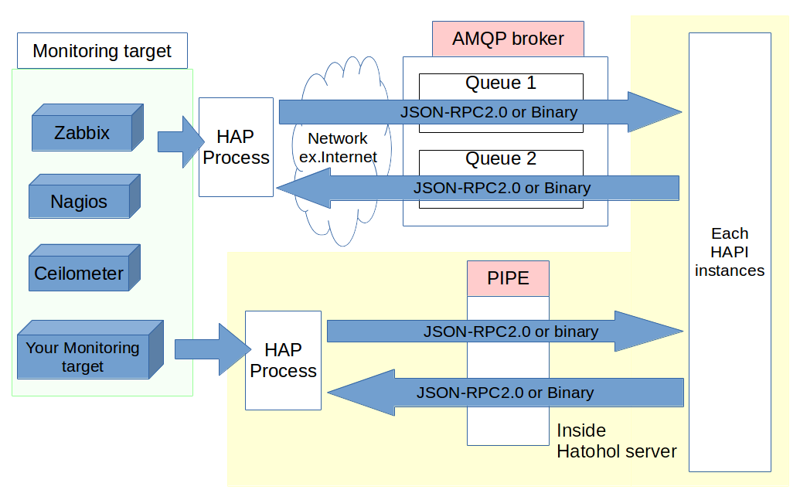

# HAP(Hatohol Arm Plugin)

※シーケンス図をどっかに描く

## 概要

HAPはJSON-RPC 2.0を用い、Hatoholサーバーと通信を行います。
JSON-RPCの仕様については[公式リファレンス](http://www.jsonrpc.org/specification)をお読みください。

 

 - 現在、Hatoholはutf-8を標準的な文字コードとし、作成されています。utf-8を使用することを推奨します。
 - リクエスト・レスポンスで使用するIDには、十分な(十分とは？)ランダム性が必要。
- JSON-RPCにはバッチリクエストという、複数のリクエストを同時に送信する文法も存在しますが、Hatoholはこの文法を用いたリクエストには対応していません。
 - number型の値には正の整数を用いてください。浮動小数点数や負の整数を用いることは出来ません。
 - 通信の方向がHAP -> SRVとなっているコマンド内のnumber型の範囲は0~2147483647。 
 - オブジェクトの名前として各要素のID、値としてそのIDに対応している各値を更にオブジェクト形式で記述してください。ここに記述するIDはユニークである必要があります。

## データ型定義

|名前|JSON型|解説|
|:---|:---------|:---|
|timestamp|string|時刻フォーマットはyyyyMMDDHHmmss.nnnnnnnnnです。小数点以下の時刻については省くことが出来ます。また、小数点以下には9桁までしか値を挿入することはできません。小数点以下を省いた場合、または小数点以下が9桁未満の場合には余った桁部に0が挿入されます。(Ex.100 -> 100.000000000, 100.1234 -> 100.123400000)。|
|boolean|true, false|true or falseを指定し、その値の真偽を示します|

## コマンド一覧

|コマンド名               |解説|HAP -> SRV|SRV -> HAP|メソッドタイプ|
|:------------------------|:---|:--------:|:--------:|:-------------:|
|[getMonitoringServerInfo](#user-content-getMonitoringServerInfo)|監視サーバーの接続情報やポーリング間隔等を取得します|Yes|-|method|
|[getLastEventId](#user-content-getLastEventId)|Hatoholサーバーに保存されている最新イベントのIDを取得します|Yes|-|method|
|[getLastEventTime](#user-content-getLastEventTime)|Hatoholサーバーに保存されている最新イベントの発生時間を取得します|Yes|-|method|
|[getIfHostsChanged](#user-content-getIfHostsChanged)|直前のsendHostsによってHatoholサーバー内のホスト情報が変更の真偽を取得します|Yes|-|method|
|[sendHosts](#user-content-sendHosts)|監視サーバーが監視しているホスト一覧をHatoholサーバーに送信します|Yes|-|notification|
|[sendHostGroupElements](#user-content-sendHostGroupElements)|ホストのホストグループ所属情報をHatoholサーバーに送信します|Yes|-|notification|
|[sendHostGroups](#user-content-sendHostGroups)|ホストグループの情報をHatoholサーバーに送信します|Yes|-|notification|
|[sendUpdatedEvents](#user-content-sendUpdatedEvents)|アップデートされたイベントをHatoholサーバーに送信します|Yes|-|notification|
|[sendArmInfo](#user-content-sendArmInfo)|HAPの接続情報をHatoholサーバーに送信します|Yes|-|notification|
|[sendTriggers](#user-content-sendTrigges)|トリガーをHatoholサーバーに送信します。送信するトリガーはオプションで指定することが出来ます|Yes|-|notification|
|[reqFetchItems](#user-content-reqFetchItems)|HatoholサーバーからHAPへアイテム一覧取得のリクエストを送信します|-|Yes|method|
|[reqTerminate](#user-content-reqTerminate)|HAPとHatoholサーバーとの接続を終了させます|-|Yes|method|
|[reqFetchHistory](#user-content-reqFetchHistory)|HatoholサーバーからHAPへヒストリー一覧取得のリクエストを送信します|-|Yes|method|
|[reqFetchTriggers](#user-content-reqFetchTriggers)|HatoholサーバーからHAPへトリガー一覧取得のリクエストを送信します|-|Yes|method|

## 各コマンド解説

### getMonitoringServerInfo(method)

**params**

getMonitoringServerInfoメソッドには引数が存在しません。nullオブジェクトとしてparamsを送信してください。

**result**

|名前|型|Mandatory|デフォルト値|値の範囲|解説|
|:---|:--|:----------:|:---------:|:------:|:---|
|serverId          |number|Yes|-|正の整数|監視サーバーのserverId|
|url               |string|Yes|-|65535byte以内|監視サーバーのURL [[解説](#user-content-serverType)]|
|type              |number|Yes|-|0-4|監視サーバーの種類 [[一覧](#user-content-serverType)]|
|nickName          |string|Yes|-|65535byte以内|監視サーバーのニックネーム|
|userName          |string|Yes|-|65535byte以内|監視サーバーのユーザーネーム|
|password          |string|Yes|-|65535byte以内|監視サーバーのパスワード|
|dbName            |string|Yes|-|65535byte以内|監視対象のデータベースのパスワード。登録の際にdbNameが必要ない場合は「""」を送信してください。|
|pollingIntervalSec|number|Yes|-|正の整数|ポーリングを行う間隔|
|retryIntervalSec  |number|Yes|-|正の整数|ポーリングが失敗した場合、リトライを行うまでの間隔|
|extra             |string|Yes|-|プラグイン固有の情報|

```
{"jsonrpc":"2.0", "result":{"hostName":"exampleHost", "type":0, "ipAddress":"127.0.0.1", "nickName":"exampleName", "userName":"Admin", "password":"examplePass", "dbName":"", "port":80, "pollingIntervalSec":30, "retryIntervalSec":10}, "id":1}
```

### getLastEventId(method)

**params**

getLastEventIdメソッドには引数が存在しません。nullオブジェクトとしてparamsを送信してください。

**result**

|名前|型 |Mandatory|デフォルト値|値の範囲|解説|
|:---|:--|:-------:|:----------:|:------:|:---|
|lastEventId|number|Yes|-|65535byte以内|Hatoholサーバーに保存されている最新イベントのID|

```
{"jsonrpc":"2.0", "result":{"lastEventId":1}, "id":1}

```

### getLastEventTime(method)

同時刻に発生したイベントが存在する場合、取得するイベントが重複する可能性があります。

**params**

getLastTimeOfEventメソッドには引数が存在しません。paramsをnullオブジェクトにして送信してください。

**result**

|名前|型 |Mandatory|デフォルト値|値の範囲|解説|
|:---|:--|:-------:|:----------:|:------:|:---|
|lastEventTime|timestamp|Yes|-|-|Hatoholサーバーに保存されている最新イベントのタイムスタンプ|

```
{"jsonrpc":"2.0", "result":{"lastEventTime":1}, "id":1}
```

### getIfHostsChanged(method)

ホスト増減も自分で管理
ラストトリガーは廃止

**params**

getIfHostsChangedメソッドには引数が存在しません。paramsをnullオブジェクトにして送信してください。

**result**

|名前|型 |Mandatory|デフォルト値|値の範囲|解説|
|:---|:--|:-------:|:----------:|:------:|:---|
|type|boolean|Yes|-|-|監視サーバーが監視しているホストが変更されたかを判断します|

### sendTriggers(notification)

**params**

名前：トリガーID

値：

|名前|型 |Mandatory|デフォルト値|値の範囲|解説|
|:---|:--|:-------:|:----------:|:------:|:---|
|option        |string|Yes|-|-            |トリガーオプション [[一覧](#user-content-triggerOption)]|
|status        |number|Yes|-|正の整数     |トリガーのステータス [[一覧](#user-content-triggerStatus)]|
|severity      |number|Yes|-|正の整数     |トリガーの種別 [[一覧](#user-content-triggerSeverity)]|
|lastChangeTime|string|Yes|-|65535byte以内|トリガーが最後に更新された時間|
|hostId        |string|Yes|-|正の整数     |トリガーが所属するホストID|
|hostName      |string|Yes|-|65535byte以内|トリガーが所属するサーバーのホスト名|
|brief         |string|Yes|-|65535byte以内|トリガーの概要|
|extendedInfo  |string|Yes|-|65535byte以内|上記の情報以外の必要な情報。主にWebUI上にデータを表示する際に用いられる|

```
{"jsonrpc":"2.0", "method":"sendTriggers", "params":{{"1",{"option":"UPDATED", "status":"OK", "severity":"INFO","lastChangeTime":"201503231758", "hostId":"1", "hostName":"exampleName", "brief":"example brief", "extendedInfo": "sample extended info"}}},"id":1}
```

### sendHosts(notification)

**params**

オブジェクトの名前：ホストID

オブジェクトの値：

|名前|型 |Mandatory|デフォルト値|値の範囲|解説|
|:---|:--|:-------:|:----------:|:------:|:---|
|hostName|string|Yes|-|65535byte以内|監視サーバーが監視しているホスト名|

```
{"jsonrpc":"2.0","method":"sendHosts", "params":{{"1":"exampleHostName1"},{"2":"exampleHostName2"}}}
```

### sendHostGroupElements(notification)

**params**

オブジェクトの名前：ホストID

オブジェクトの値：

|名前|型 |Mandatory|デフォルト値|値の範囲|解説|
|:---|:--|:-------:|:----------:|:------:|:---|
|groupId|number|Yes|- |正の整数|監視ホストが所属しているグループのID|

### sendHostGroups(notification)

**params**

オブジェクトの名前：グループID

オブジェクトの値：

|名前|型 |Mandatory|デフォルト値|値の範囲|解説|
|:---|:--|:-------:|:----------:|:------:|:---|
|groupName|string|Yes|-|65535byte以内|監視ホストが所属するホストグループ|

### sendUpdatedEvents(notification)

**params**

オブジェクトの名前：イベントID

オブジェクトの値：

|名前|型 |Mandatory|デフォルト値|値の範囲|解説|
|:---|:--|:-------:|:----------:|:------:|:---|
|time        |string|Yes|-|65535byte以内|イベントが発生した時刻|
|type        |string|Yes|-|65535byte以内|イベントのタイプ [[一覧](#user-content-eventType)]|
|triggerId   |number|Yes|-|正の整数     |このイベントを発火させたトリガーID|
|status      |number|Yes|-|正の整数     |トリガーのステータス [[一覧](#user-content-triggerStatus)]|
|severity    |number|Yes|-|正の整数     |トリガーの種別 [[一覧](#user-content-triggerSeverity)]|
|hostId      |string|Yes|-|65535byte以内|イベントが発生したホストのID|
|hostName    |string|Yes|-|65535byte以内|イベントが発生したホストの名前|
|brief       |string|Yes|-|65535byte以内|イベントの説明。Web上に表示される情報|
|extendedInfo|string|Yes|-|65535byte以内|briefには書いていない追加の情報を記述できます|

```
{"jsonrpc":"2.0", "method":"sendUpdatedEvents", "params":{{"1",{"time":"201503231513, "type":"GOOD", "triggerId":2, "status": "OK","severity":"INFO":, "hostId":3, "hostName":"exampleName", "brief":"example brief", "extendedInfo": "sampel extended info"}}},"id":1}
```

### sendArmInfo(notification)

情報の取得処理が行われるたびに送信することを標準的な動作とするが、それ以外の状況で送信してもよい。最小間隔は１秒（MUST）、最大間隔はgetMonitoringServerInfoで取得したポーリング時間の2倍（SHOULD）とする。

```

SRV                             HAP
 |    Initiation                 |
 |------------------------------>|
 |                               |
 | getMonitoringServerInfo       |
 |<------------------------------|
 | Response(polling sec, etc...) |
 |------------------------------>|
 |                           |   |
 |                           |   |
 |                  polling sec  |
 |                           |   |
 |    Host                   |   |
 |<------------------------------|
 |         Trigget               |
 |<------------------------------|
 |                 Event         |
 |<------------------------------|
 |                   sendArmInfo |
 |<------------------------------|
 |                           |   |
 |                  polling sec  |
 |                           |   |

```

**params**

|名前|型|Mandatory|デフォルト値|値の範囲|解説|
|:---|:--|:---------:|:----------:|:------:|:---|
|lastStatus         |string |Yes|-|-|最新のポーリング結果 [[一覧](#user-content-armInfoStatus)]|
|failureReason  |string |Yes|-|65535byte以内|情報取得が失敗した理由|
|lastSuccessTime|timestamp |Yes|-|-|最後に情報取得が成功した時刻|
|lastFailureTime|timestamp |Yes|-|-|最後に情報取得が失敗した時刻|
|numSuccess     |number |Yes|-|正の整数|HAPが起動してから情報取得に成功した回数|
|numFailure     |number |Yes|-|正の整数|HAPが起動してから情報取得に失敗した回数|

```
{"jsonrpc":"2.0", "method":"sendArmInfo", "params":{"lastStatus":"INIT", "failureReason":"Example reason", "lastSuccessTime":"201503131611", "lastFailureTime":"201503131615", "numSuccess":165, "numFailure":10}, "id":1}
```

### reqFetchItems(method)

**params**

reqFetchItemsメソッドには引数が存在しません。paramsをnullオブジェクトにして送信してください。

**result**

|名前|型|Mandatory|デフォルト値|値の範囲|解説|
|:---|:--|:----------:|:---------:|:------:|:---|
|serverId     |number|Yes|-|正の整数   |アイテムが所属するサーバーのID|
|hostId       |number|Yes|-|正の整 数  |アイテムが所属するホストのID|
|brief        |string|Yes|-|65535byte以内|各アイテムの概要|
|lastValueTime|string|Yes|-|65535byte以内|各アイテムが最後に更新された時間|
|lastValue    |string|Yes|-|65535byte以内|各アイテムが最後に更新された際の値|
|prevValue    |string|Yes|-|65535byte以内|各アイテムが最後に更新される前の値|
|itemGroupName|string|Yes|-|65535byte以内|アイテムをグループ分けしたもの<br>任意のグループ名をご使用ください|
|unit         |string|Yes|-|65535byte以内|valueの単位|

### reqTerminate(notification)

**params**

reqTerminateメソッドには引数が存在しません。paramsをnullオブジェクトにして送信してください。

### reqFetchHistory(method)

**params**

名前:サーバーID

値：

|名前|型 |Mandatory|デフォルト値|値の範囲|解説|
|:---|:--|:-------:|:----------:|:------:|:---|
|hostId   |string|Yes|-|255文字以内|ヒストリーのアイテムが所属しているホストID|
|itemId   |number|Yes|-|正の整数   |ヒストリーのアイテムID|
|valueType|string|Yes|-|255文字以内|取得したヒストリーのアイテムタイプ [[一覧](#user-content-itemValueType)]|
|beginTime|string|Yes|-|255文字以内|ヒストリー取得域の始点時間を指定します|
|endTime  |string|Yes|-|255文字以内|ヒストリー取得域の終点時間を指定します|

**result**

|名前|型 |Mandatory|デフォルト値|値の範囲|解説|
|:---|:--|:-------:|:----------:|:------:|:---|
|itemId|number|Yes|-|正の整数   |ヒストリーのアイテムID|
|value |string|Yes|-|65535byte以内|clock時点でのアイテムの値|
|clock |string|Yes|-|65535byte以内|このヒストリーの値が記録された時刻|

### reqFetchTriggers(method)

**params**

reqFetchTriggersメソッドには引数が存在しません。paramsをnullオブジェクトにして送信してください。

**result**

|名前         |型|Mandatory|デフォルト値|値の範囲|解説|
|:------------|:----|:----:|:----------:|:------:|:---|
|status        |number|Yes|-|正の整数     |トリガーのステータス|
|severity      |number|Yes|-|正の整数     |トリガーの種別 [[一覧](#user-content-triggerSeverity)]|
|lastChangeTime|string|Yes|-|65535byte以内|トリガーが最後に更新された時間|
|hostId        |number|Yes|-|正の整数     |監視サーバー内で設定されているホストID|
|hostName      |string|Yes|-|65535byte以内|トリガーが所属するサーバーのホスト名|
|brief         |string|Yes|-|65535byte以内|トリガーの概要|
|extendedInfo  |string|Yes|-|65535byte以内|上記の情報以外の必要な情報。主にWebUI上にデータを表示する際に用いられる|

## エラーコード

リクエストに成功した場合、送信したリクエストに応じたresultオブジェクトが返されます。
リクエストに失敗した場合、resultオブジェクトではなくerrorオブジェクトが返されます。
このセクションではエラーオブジェクトとして返ってくるエラーコードとエラーメッセージについて解説します。

※各メソッド定義後に埋めていく

|code|message|meaning|
|:--|:-------|:---|
|1  |Unknown error|原因不明のエラーが起こっています|

## 表

### armInfoStatus

|ステータス|解説|
|:---------|:---|
|"INIT"   |初期状態。まだ通信を行っていない|
|"OK"     |通信に成功している|
|"FAILURE"|通信に失敗している|

### serverType

※URLは別途

|名前|UUID|URL|
|:---|:--|
|Zabbix|0|
|Nagios|1|
|Zabbix(HAPI)|2|
|JSON(HAPI)|3|
|Ceilometer|4|

### triggerSeverity

トリガーの種別です。任意のステータスを各トリガーに設定してください。

|種別|
|:---|
|ALL      |
|UNKNOWN  |
|INFO     |
|WARNING  |
|ERROR    |
|CRITICAL |
|EMERGENCY|

### triggerStatus

|ステータス|解説|
|:---------|:---|
|ALL    |初期状態。まだ通信を行っていない|
|OK     |通信に成功している|
|PROBLEM|通信に失敗している|
|UNKNOWN|状態不明|

### triggerOption

|種類|解説|
|:---------|:---|
|"ALL"    |全てのトリガーを送信する|
|"UPDATED"|アップデートされたトリガーのみ送信する|
|"SELF"   |HAP自身のトリガーを送信する|

### eventType

イベントのタイプです。任意のタイプを各イベントに設定して下さい。

|タイプ|解説|
|:-----|:--:|
|GOOD   |正常|
|BAD    |異常|
|UNKNOWN|不明|

### itemInfoValueType

アイテムのタイプです。任意のタイプを各アイテムに設定して下さい。

|タイプ|解説|
|:-----|:---|
|UNKNOWN|未定義  |
|FLOAT  |float型 |
|INTEGER|int型   |
|STRING |string型|
